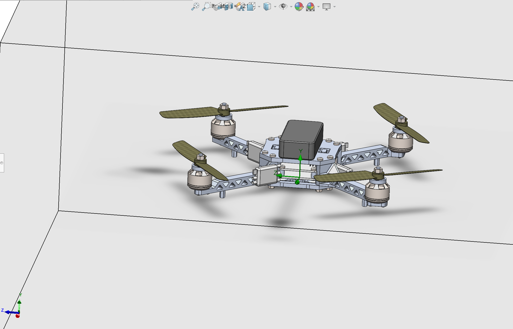

# CFD Analysis of Quadcopter Drone – Hover Optimization

  

## Overview
This project evaluates and optimizes the aerodynamic performance of a quadcopter drone in hover using **SOLIDWORKS Flow Simulation**. The goal was to determine whether the propeller configuration generated sufficient lift for stable hover and to iteratively improve thrust through geometry and simulation refinement.

---

## Objective
- Simulate quadcopter hover performance using rotating propeller regions
- Quantify lift, torque, and airflow velocity
- Compare generated thrust against drone weight
- Optimize propeller design and operating RPM to achieve stable hover

---

## Tools & Technologies
- **CAD & Simulation:** SOLIDWORKS, Flow Simulation
- **Analysis Methods:** CFD, rotating reference regions, goal tracking
- **Outputs:** Force, torque, velocity, pressure, flow trajectories

---

## Simulation Setup
- Four propellers modeled using **rotating regions**
- Initial rotational speed: **5000 RPM**
- Tracked global goals:
  - **Force (Y)**
  - **Torque (Y)**
  - **Velocity (Y)**
- Pressure and velocity fields analyzed to evaluate downwash quality

  
  

---

## Baseline Results
- Total upward force: **≈ 9.8 N**
- Drone weight: **12.0 N (1226.6 g)**
- Result: **Insufficient thrust for stable hover**

The baseline configuration produced uneven downwash and insufficient lift to balance the drone’s weight.

---

## Design Iteration & Optimization
To improve performance, the following changes were made:
- Increased **propeller pitch**
- Smoothed airfoil geometry to reduce losses
- Refined mesh near **blade tips**
- Increased rotational speed to **6500 RPM**

  

---

## Optimized Results
- Total upward force: **≈ 12.4 N**
- Achieved lift sufficient to balance drone weight
- Stronger and more uniform downwash observed in flow trajectories

This validated the effectiveness of data-driven design iteration using CFD.

---

## Repository Contents
- `media/` — CAD renders and CFD visualization plots  
- `exports/` — STEP/STL files for viewing and reuse  
- `results/` — summarized numerical outcomes  

---

## Future Improvements
- Add inlet/outlet boundary conditions for higher-fidelity flow modeling
- Validate CFD results with physical thrust measurements
- Investigate blade count and diameter trade-offs

---

## Full CAD Files
Full SOLIDWORKS part and assembly files are available here:  
📁 **[https://drive.google.com/drive/folders/1V2xeAQCjvXTpIAZPWTNvF8RqzsDxHy1q?usp=drive_link]**
